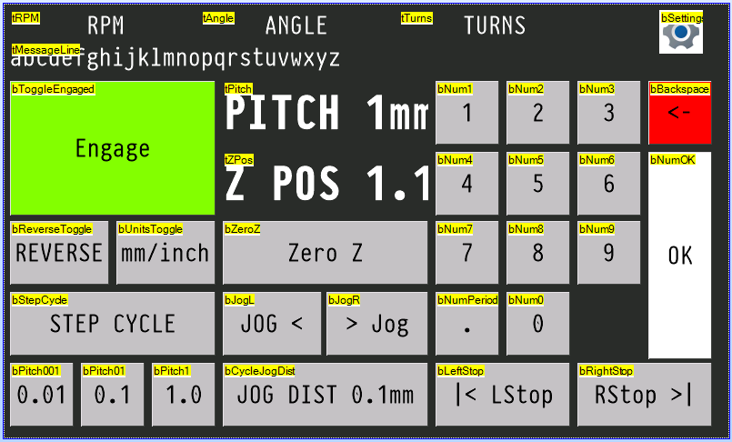
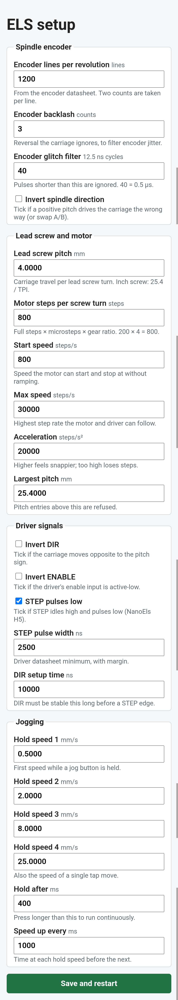

# leels: single-axis electronic gearbox

[](https://github.com/leehambley/leels/actions/workflows/ci.yml)

A Rust/Embassy port of the gearbox mode of
[NanoEls H5](https://github.com/kachurovskiy/nanoels), cut down to one job:
the Z lead screw follows the spindle at the selected pitch. There is no WiFi,
no other modes, no X/Y axis, no keyboard or joystick, and no GCode.

```
els-core/   hardware-independent logic, no_std, host-tested (cargo test)
firmware/   esp-hal + esp-rtos (Embassy) binary; ESP32-C6 primary, ESP32-S3 secondary
docs/       Nextion page layout
```

## Build and flash

```sh
cd els-core && cargo test          # logic tests on the host

cd firmware
cargo run --release                # ESP32-C6 (default, stable Rust): build, flash, monitor
cargo build --release
cargo run --release --features setup-on-boot   # bench test without a display: hotspot at power-up
cargo +esp s3                      # ESP32-S3: needs the Xtensa toolchain (espup)
```

Board-specific values are in `firmware/src/config.rs`: pinout, motion timing,
display and hotspot settings, and `DEFAULTS`, the machine settings used until
you save your own. Machine settings are normally changed without recompiling,
from the setup page (below).
- **C6** pins (placeholders; change for your board): encoder 2/3, STEP 4, DIR 5, ENA 6, Nextion TX 22 / RX 23.
- **S3** pins: NanoEls H5 pinout (encoder 13/14, STEP 35, DIR 42, ENA 41, Nextion TX 43 / RX 44).

The spindle encoder has open-drain outputs, so the ESP32's internal pull-ups
(already enabled) pull A/B up to 3.3 V. No level shifting is needed on either
chip. For anything beyond slow speeds, fit external pull-ups: see
[Speed limits](#speed-limits-compared-with-nanoels-h5).

Logs go to USB-Serial-JTAG, which leaves both UARTs free.

## Operation



The screen layout in the Nextion Editor, with each component's object name.
See [docs/nextion.md](docs/nextion.md) for what each one does.

- **Pitch** is a number plus a unit. Type it on the keypad and press **OK**
  (the pending number shows in amber with a cursor; hold **<-** to clear it),
  or tap a preset (**0.01 / 0.1 / 1.0**). **REVERSE** flips direction.
  **UNIT** keeps the number and changes the unit (0.100 mm becomes 0.100").
  Pitch is capped at 1". Pitch can't be changed while engaged: disengage
  first.
- **Engage / Disengage** is one button: it closes the virtual half-nut at the
  current position, or opens it, stopping the lead screw immediately.
- **Stops**: pressing Stop L or Stop R sets that stop at the current position.
  The button turns amber and shows the stop's Z; it turns red with `AT STOP`
  while the carriage rests on it. Pressing it again clears it, but only while
  disengaged or resting on the stop. Stops limit threading and jogging. The
  carriage parks on a stop while the spindle keeps turning. Reverse the
  spindle and it leaves the stop within one turn, still in thread phase. If
  you clear a stop while resting on it, the engage button shows `Syncing` and
  the carriage waits for the thread phase before moving on. **Zero Z** also
  clears both stops.
- **Jog** (disengaged only; refused with a beep while engaged): **Jog L / Jog R**
  move the carriage. Stops limit jogging too.
  - The jog distance (.01 / .1 / 1 / 10 in the current unit, cycled with its
    own button) also sets the jog speed: 0.5 / 2 / 8 / 25 mm/s.
  - A **tap** moves exactly the jog distance at that speed. Repeated taps add
    up.
  - A **hold** longer than 0.4 s runs continuously, starting at the same speed
    and stepping up one speed every second until 25 mm/s. Releasing brakes to
    a stop. Pressing the other direction while moving also brakes.
  - Speeds and timings are set on the setup page.
- **Setup** (only when disengaged and not jogging) turns on a WiFi hotspot,
  `LEELS-SETUP` with password `els-setup`. Both are shown on the display.
  Phones open the settings page automatically as a sign-in page; otherwise
  browse to `http://192.168.4.1/`. The page covers:
  - the encoder (lines, backlash, glitch filter, direction);
  - the lead screw and motor (pitch, steps, start/max speed, acceleration,
    largest pitch);
  - driver signals (DIR/ENABLE inversion, STEP polarity, pulse width, DIR
    setup time);
  - jog speeds and timings.

  **Save** checks the values, writes them to flash and restarts with WiFi off.
  Pressing Setup again leaves without saving. Pins stay fixed in the firmware.

  
- **Remembered across power-off:** pitch, unit, pitch step and jog distance.
  They're saved 3 s after the last change, once the carriage is idle. Stops
  and position are not saved, because the carriage may be moved while the
  controller is off.

## Saved data

Settings and operator state live in the first four sectors of the flash's NVS
partition, as raw records (not ESP-IDF NVS). Each record has:
- a **magic number**, so blank flash (`0xFF`) and random data are told apart;
- a **format version**, for migrations;
- the **length**, a **sequence number** and a **CRC32**.

Two slots per record are written alternately, and the newer valid one wins,
so a power cut during a save keeps the previous copy. Blank flash means
first boot, and the defaults are used. A damaged record, or one from a newer
firmware, also falls back to the defaults, and the display says so. Flash
writes pause the CPU for tens of milliseconds, so they only happen while
nothing moves.

## How motion works

Software plans the motion and hardware times the pulses: the same split as
LinuxCNC's stepgen or Klipper.

```
 PCNT spindle count ─► predict spindle position at end of next segment
                         │
       commands ───────► gearbox (engaged) or jog (disengaged) ─► target
                         │
                       StepGen: velocity/acceleration-limited plan for one
                       250 µs segment → exact STEP pulse times
                         │
                       RMT plays the segment in hardware (100 ns resolution)
                       while the next segment is planned
```

- `motion_task` runs on a high-priority interrupt executor, paced by the RMT
  peripheral. Each loop starts playing the segment planned last time, plans
  the next one, then waits for playback to finish. That's 4,000 wakeups a second.
- The gearbox target is `p_ref + (spindle − s_ref) · pitch·steps / (screw·counts)`,
  in exact integer maths, including the fraction of a step. It's evaluated at
  the spindle position predicted for the end of the segment, so the carriage
  doesn't lag the spindle.
- StepGen (`els-core/src/stepgen.rs`) sets each segment's velocity from:
  - feed-forward: how fast the target is moving;
  - a correction for any remaining error, limited so the error could still be
    braked away (`√(2·a·error)`).

  Velocity is constant within a segment, so pulses are evenly spaced. Host tests
  check a steady spindle gives step intervals within ±0.1 µs of ideal, and that
  a realistic spindle run-up never lags by more than 1 step.
- The maximum step rate is set by the pulse width and the driver (30 k steps/s
  configured), not by a software tick.
- The UI and display run on the normal thread executor. They talk to motion
  through a command channel and a status snapshot.

Known limitation: esp-hal's RMT driver restarts transmission for each
segment, which leaves a few-µs gap between segments. Position isn't affected,
because every step is still planned against the spindle. A gapless version
would need a custom RMT ring-buffer driver.

## Speed limits compared with NanoEls H5

Example machine: a 1200-line encoder driven 1:1 by the spindle (2400 counts
per revolution), 800 steps per screw turn, 4 mm screw (200 steps/mm).
Channel A then runs at **20 Hz per spindle rpm**, and at 1 mm pitch the motor
needs **3.33 steps/s per rpm**.

| | NanoEls H5 original (S3, Arduino) | leels on C6 (primary) | leels on S3 |
|---|---|---|---|
| CPU | 2 × 240 MHz; motion busy-loops on core 1 | 1 × 160 MHz, shared | 2 × 240 MHz; everything on core 0 |
| Encoder counting | PCNT hardware | PCNT hardware | PCNT hardware |
| Encoder glitch filter | 12.5 ns | 0.5 µs (settable) | 0.5 µs (settable) |
| STEP pulses made by | software in `loop()`, polling `micros()` | RMT hardware, 100 ns resolution | RMT hardware, 100 ns resolution |
| Step timing jitter | about one `loop()` pass plus 1 µs `micros()` steps; interrupts on core 1 add to it (estimated) | 0.1 µs within a segment; ~11 µs pause every 250 µs (measured) | same design; pause likely shorter (not measured) |
| Pulse width | length of the code between the two pin writes | exactly as set (2.5 µs default) | exactly as set |
| Step-rate ceiling from the controller | speed of `loop()`: tens of kHz, estimated | 30k steps/s as configured; ~128k possible (32 steps per segment) | same as C6 |
| CPU used by motion | all of core 1 | ~75 µs per 250 µs segment, ~30% (measured) | expected ~20% of core 0 at 240 MHz (not measured) |
| Lag behind the spindle | about one loop pass | ≤ 1 step during spin-up (host tests; position predicted ahead) | same as C6 |

**Maximum rpm is the same on all three.** With hardware pull-ups none of the
controllers is the limit. What is:

1. **The encoder's rated output frequency.** Cheap optical encoders are often
   rated around 100 kHz; check your datasheet. 100 kHz / 20 Hz per rpm =
   **5,000 rpm**. The PCNT counter itself handles MHz rates, and leels'
   0.5 µs glitch filter still passes up to about 1 MHz (50,000 rpm).
2. **The stepper at speed.** A typical stepper at 4× microstepping becomes
   unreliable around 10–15k steps/s (depends on supply voltage and load).
   That's about **3,000–4,500 rpm at 1 mm pitch** and **120–180 rpm at 1"**
   (85 steps/s per rpm). The same motor limits all three controllers.
3. **leels' `speed_max`** (30k steps/s by default) is about 9,000 rpm at
   1 mm pitch, so it's well clear of both.

### Pull-ups and encoder edges

An open-drain output only pulls low. The pull-up resistor and the capacitance
of the cable and input (roughly 100 pF per metre of cable) set how slowly each
edge rises. An input reads high at about 75% of 3.3 V, which takes about
1.4 × R × C.

| Pull-up to 3.3 V | Rise time (1 m cable, ~100 pF) | Rise time (3 m, ~300 pF) | rpm before edges get marginal* |
|---|---|---|---|
| internal, ~45 kΩ | ~6 µs | ~19 µs | ~4,000 (1 m), ~1,300 (3 m) |
| external 4.7 kΩ | ~0.7 µs | ~2 µs | encoder-limited (~5,000) |
| external 2.2 kΩ | ~0.3 µs | ~1 µs | encoder-limited (~5,000) |

\*Rise time equal to half a period of channel A: 1 / (2 × 20 Hz × rpm).
Before that point, slow edges can also count twice if noise crosses the
threshold. This applies equally to the original firmware, which used the
same internal pull-ups.

Use **2.2–4.7 kΩ to 3.3 V, not 5 V**: ESP32 inputs aren't 5 V tolerant, and
at 3.3 V the encoder only has to sink about 1.5 mA.

### Multiple cores

- **C6:** one main core; its second core is a 20 MHz low-power core that can't
  run any of this. Motion runs on a high-priority interrupt executor that
  preempts the display, touch and WiFi tasks, and uses ~30% of the core.
- **S3:** motion *can* be moved to core 1 (`esp_rtos::start_second_core`,
  then start the motion interrupt executor there). It **isn't needed for
  speed**: RMT times the pulses, and planning only has to finish within each
  250 µs segment, which it does with room to spare even on the C6. The only
  benefit would be isolating motion from WiFi interrupts on the S3. Flash
  writes stall both cores regardless, which is why saves only happen while
  idle. Worth doing only if an S3 build ever shows planning overruns.

## Not carried over

Saving stops and position across power-off, backlash compensation, TPI
entry, the max-travel E-stop, and enable/disable per axis.
